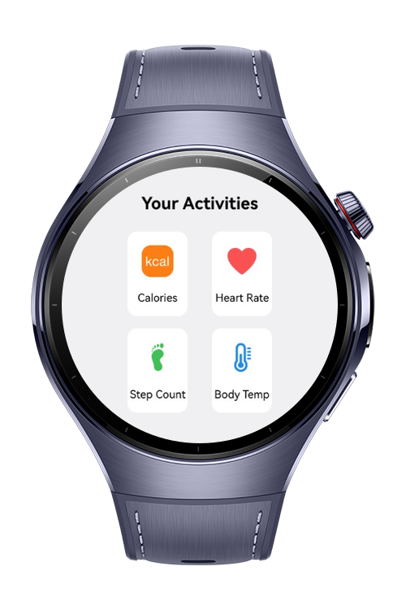
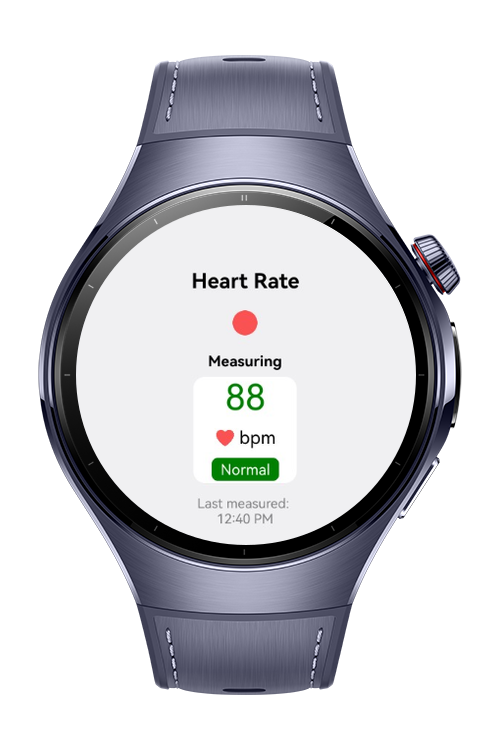
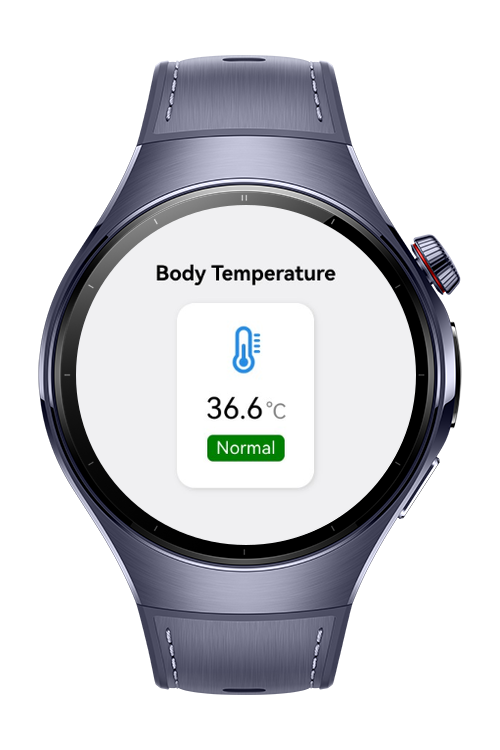
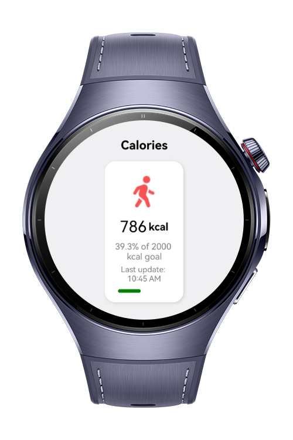

> **Note:** To access all shared projects, get information about environment setup, and view other guides, please visit [Explore-In-HMOS-Wearable Index](https://github.com/Explore-In-HMOS-Wearable/hmos-index).

# Healio

This application is a simple activity dashboard that provides users with quick access to their daily health metrics.
It displays four interactive cards, each containing an icon and a label, and every card leads to a dedicated page when tapped.

1. Calories – Opens the calorie tracking page where users can monitor and manage their energy intake.

2. Heart Rate – Navigates to the heart rate monitoring page for viewing heartbeat data and related statistics.

3. Step Count – Directs to the step counter page to track walking activity and progress.

4. Body Temperature – Leads to the body temperature page, showing insights into current measurements.

The cards are styled with rounded edges, centered content, and a clean layout. At the top, the title “Your Activities” introduces the section. This design gives users a structured and visually clear way to reach different health-tracking features with just a tap.

# Preview

<div>
    
    
    
    
</div>

# Use Cases

1. Daily Health Overview: Users can quickly check their core health metrics such as calories, heart rate, step count, and body temperature from a single dashboard.

2. Calorie Monitoring: Navigate to the calories page to track daily energy intake and maintain a balanced diet.

3. Heart Rate Tracking: Open the heart rate page to monitor heartbeat data, detect irregularities, or keep a record for fitness purposes.

4. Step Counting: Access the step counter page to measure walking activity, set daily goals, and track progress.

5. Temperature Awareness: Visit the body temperature page to stay informed about body conditions and detect changes early.

6. Centralized Navigation: Provide users with an intuitive entry point where all health-related features are available through simple, interactive cards.

# Tech Stack

- **Languages**: ArkTS
- **Frameworks**: HarmonyOS SDK 5.1.0(18)
- **Tools**: DevEco Studio Vers 5.1.0.842
- **Libraries**: @kit.ArkUI
- 
# Directory Structure
   ```
   entry/src/main/ets/
   |---pages
   |   |---Index.ets                           // Home Page
   |   |---BodyTemp.ets                        // Body Temp Page
   |   |---Calorie.ets                         // Calorie Page
   |   |---HeartRate.ets                       // Heart Rate Page
   |   |---StepCount.ets                       // Step Count Page
   ```

# Constraints and Restrictions
## Supported Devices
- Huawei Watch 5

# License
**HealioApp** is distributed under the terms of the MIT License
See the [LICENSE](./LICENSE) for more information.